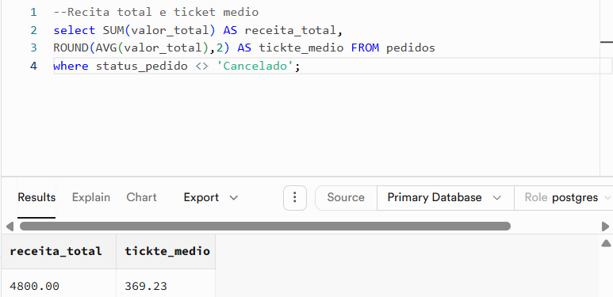
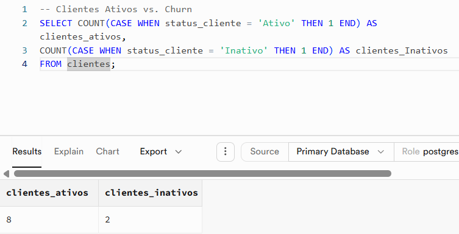
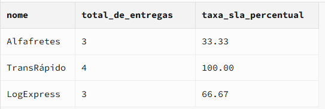
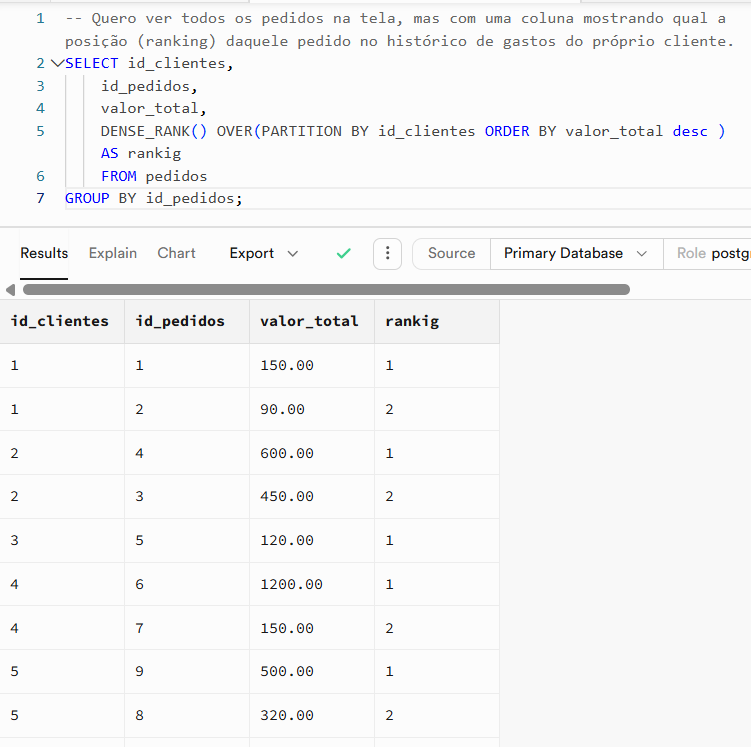

# 🛒 E-Commerce & Logistics SQL Analytics Project (PostgreSQL & Supabase)

Este projeto prático foi desenvolvido para simular o banco de dados de uma operação real de e-commerce, utilizando PostgreSQL. O objetivo principal é extrair indicadores-chave de performance (KPIs) para tomada de decisão estratégica, servindo como uma base de dados otimizada e pronta para consumo em ferramentas de BI (como o Power BI).

---
Modelo Relacional Atualizado

O banco de dados foi reestruturado para suportar análises temporais e de eficiência logística precisas. A tabela de `entregas` agora conecta-se diretamente à tabela de `pedidos`, permitindo o cálculo real de *Lead Time* e quebras de acordos de nível de serviço (SLA).

* **`clientes`**: Dados cadastrais, demográficos e status da conta (Ativo/Inativo para cálculo de Churn).
* **`pedidos`**: Histórico de compras com data do pedido e valor total.
* **`transportes`**: Cadastro de parceiros logísticos e sua disponibilidade.
* **`entregas`**: Operação de *last-mile*, contendo datas de envio, datas de entrega efetiva e o prazo prometido em dias ao cliente.

---

Conceitos Técnicos Avançados Aplicados

Nesta análise de dados, apliquei recursos avançados de SQL utilizados por Engenheiros e Analistas de Dados:
* **Window Functions (`OVER`)**: Utilizadas para cálculos analíticos sem a necessidade de sumariar ou contrair as linhas. Aplicado com `DENSE_RANK()`, `SUM() OVER()` para faturamento acumulado no tempo e `LAG()` para comparação de registros atuais com os anteriores.
* **Subqueries Correlacionadas**: Consultas internas que dependem do contexto da linha atual da consulta externa. Aplicadas para buscar o último pedido de cada cliente e comparar gastos individuais contra médias dinâmicas.
* **Cálculo de Métricas de Negócio (Analytics)**:
  * **Financeiras**: Receita Bruta, Ticket Médio e Receita Acumulada.
  * **Crescimento**: Taxa de Churn, Retenção e Clientes Recorrentes.
  * **Logística (SLA)**: Cálculo de *Lead Time* em dias reais (`data_entrega_efetiva - data_envio`) e percentual de entregas no prazo.
* **Views Estratégicas (`CREATE VIEW`)**: Criação da camada de modelagem virtual (`v_analytics_ecommerce_master`), unindo tabelas Fato e Dimensão em um único ponto de consumo otimizado para o Power BI.

---
 Perguntas de Negócio Respondidas (Core Analytics)

O projeto responde a dores reais de negócio divididas em blocos:
1. **KPIs Clássicos de E-commerce:** Faturamento total, ticket médio, taxa de churn e volumetria de clientes recorrentes.
2.  
3. **Comportamento do Consumidor:** Identificação de perfis que mais compram, mais geram receita e clientes com maior taxa de cancelamento.
4. * 
5. **Mergulho Técnico:** Aplicação prática de lógica correlacionada e funções de janela.
6.   *  
7. **Logística:** Prazo médio de entrega por parceiro e ranking de eficiência de transportadoras com base em custo de frete e cumprimento de prazos.
8. .   *  

---
